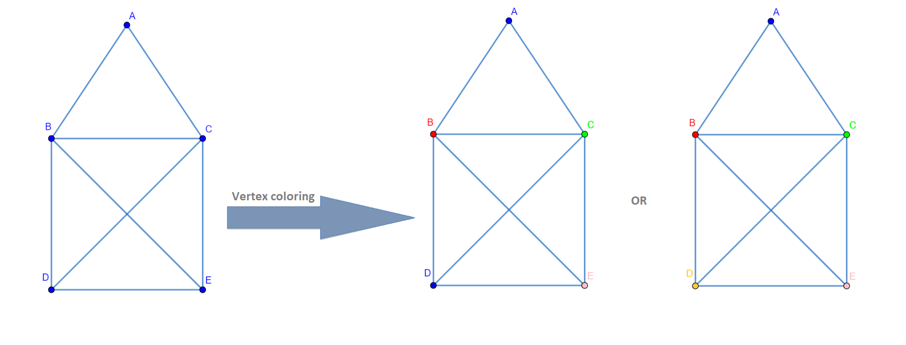

# How to Solve Sudoku With Graph Theory

In graph theory, the graph consists of vertices (nodes) and edges. On a graph, we can color vertices so that no two vertices sharing the same edge have the same color. It's called vertex coloring. Let's try.

On the given graph we can color vertices in different ways. In the first solution, it's colored with four colors and in the second solution with five colors. You can see that no two vertices sharing the same edge have the same color. 
If you are interested in more graph coloring, you can find it here.

## What is the connection with Sudoku and vertex coloring?
With this simple puzzle game called vertex coloring, we can solve many daily problems as well as Sudoku.
Remind yourself of rules for Sudoku. In a given Sudoku you have to write numbers so each number appears ones in every row, every column and every subfield of Sudoku (it is a 3x3 file in classic 9x9 Sudoku and the 2x2 file in mini 4x4 Sudoku).
It is given mini 4x4 Sudoku. First of all, for the given Sudoku we have to draw a graph in the next steps:
✔ Drow vertex for every cell in Sudoku - 16 vertices for this example.
✔ Connect the vertices that represent cells that may not contain the same numbers - For example, vertex 1 will be connected with vertices 2, 3 and 4 (same row), 5, 9 and 13 (same column) and 6 (same subfield).
✔ Color vertices that represent cells having some number in it, one color for each number- For example, in cell 1 is number 3 so vertex 1 will be colored in orange according to legend. Blue colored vertices represent empty cells.
Now we have the graph for given mini Sudoku. Maybe you already sow we have to color blue vertices for solving Sudoku. So, the next two steps are:
✔ Color uncolored vertices, do not use new colors - In our example, we have to color blue vertices, we use four colors, one color for each number from 1  to 4.
✔ Apply colored graph to given Sudoku - According to legend convert the color of each vertex to the number for the cell of Sudoku. For example, cell 4 is the first empty cell, we colored vertex 4 from blue to green so we enroll 2 in cell 4.
